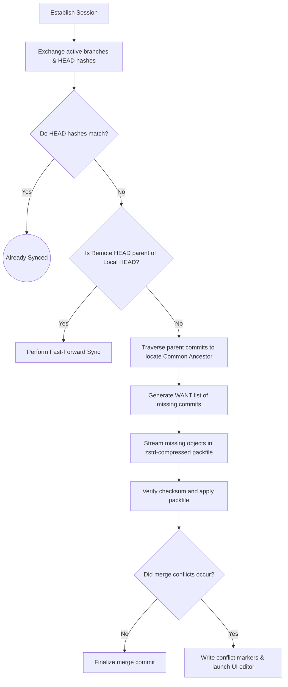

# Securenxt Communication Protocol Specification

This document details the communication protocol used by Securenxt to establish secure peer connections, negotiate repository revisions, and transfer delta packs.

## 1. Frame Layout (Byte Level)

Every payload transmitted over a socket connection is packaged in a secure frame. Below is the binary layout of the header and payload.

```
 0                   1                   2                   3
 0 1 2 3 4 5 6 7 8 9 0 1 2 3 4 5 6 7 8 9 0 1 2 3 4 5 6 7 8 9 0 1
+-+-+-+-+-+-+-+-+-+-+-+-+-+-+-+-+-+-+-+-+-+-+-+-+-+-+-+-+-+-+-+-+
|       'S'     |       'N'     |       'X'     |       'T'     |  --> Magic Bytes (0x534E5854)
+-+-+-+-+-+-+-+-+-+-+-+-+-+-+-+-+-+-+-+-+-+-+-+-+-+-+-+-+-+-+-+-+
|  Proto Ver    |                  Reserved                     |  --> Protocol version (0x01)
+-+-+-+-+-+-+-+-+-+-+-+-+-+-+-+-+-+-+-+-+-+-+-+-+-+-+-+-+-+-+-+-+
|                         Payload Length                        |  --> 32-bit big-endian length
+-+-+-+-+-+-+-+-+-+-+-+-+-+-+-+-+-+-+-+-+-+-+-+-+-+-+-+-+-+-+-+-+
|                                                               |
|                        Protobuf Payload                       |  --> Protobuf serialization
|                           (Bytes)                             |
|                                                               |
+-+-+-+-+-+-+-+-+-+-+-+-+-+-+-+-+-+-+-+-+-+-+-+-+-+-+-+-+-+-+-+-+
|                                                               |
|                    HMAC-SHA256 (32 Bytes)                     |  --> Message verification hash
|                                                               |
+-+-+-+-+-+-+-+-+-+-+-+-+-+-+-+-+-+-+-+-+-+-+-+-+-+-+-+-+-+-+-+-+
```

### 1.1 Field Descriptions
*   **Magic Bytes (4 Bytes):** Identifies incoming streams as Securenxt protocol packets.
*   **Protocol Version (1 Byte):** Initial release maps to `0x01`.
*   **Payload Length (4 Bytes):** Explains how many bytes the subsequent Protobuf frame occupies.
*   **Protobuf Payload (Variable):** An instance of a serialized `Frame` Protobuf message containing the specific state packet (Handshake, Control, or Data).
*   **HMAC-SHA256 (32 Bytes):** Computed over header and payload using the session authentication key derived during the Noise Handshake.

---

## 2. Peer Discovery Protocol (BLE Advertising)

Securenxt utilizes Bluetooth Low Energy (BLE) to advertise and discover repositories.

1.  **Advertisement Frame:** The host device advertises a standard BLE payload containing:
    *   **Service UUID:** `4e585400-bba0-4229-87a3-5c2153ae2567` (Securenxt Service ID).
    *   **Manufacturer Specific Data:** Truncated 4-byte hash of the Repository UUID. This allows scans to immediately identify which repository is being offered without exposing the full identifier.
2.  **Scan Mode:** The client scans for advertisements containing the Securenxt Service UUID. Once found, it initiates a BLE GATT connection.

---

## 3. Noise XX Handshake with Passcode Authentication

To establish a secure channel over a lossy link and prevent Man-In-The-Middle (MITM) snooping, Securenxt uses the **Noise XX Handshake** (`Noise_XX_25519_AESGCM_SHA256`).

The pairing flow executes as follows:

```
  Initiator (Collaborator)                     Responder (Repository Owner)
+--------------------------+                 +------------------------------+
|                          |                 |  1. Generate 6-digit OTP     |
|                          |                 |  2. Display OTP on screen    |
|  3. Input OTP code       |                 |                              |
|  4. Pre-key = HKDF(OTP)  |                 |  5. Pre-key = HKDF(OTP)      |
+--------------------------+                 +------------------------------+
             |                                              |
             |  Handshake Msg 1: e_B                        |
             |--------------------------------------------->|
             |                                              |
             |  Handshake Msg 2: e_A, s_A, encrypted signature
             |  (Authenticated via Pre-key PSK)            |
             |<---------------------------------------------|
             |                                              |
             |  Handshake Msg 3: s_B, encrypted signature   |
             |--------------------------------------------->|
             v                                              v
      Handshake Complete                              Handshake Complete
[Session Key (Rx/Tx) Established]             [Session Key (Tx/Rx) Established]
```

*   **OTP Integration:** The 6-digit passcode is hashed via HKDF-SHA256 to derive a 256-bit pre-shared key (PSK). This PSK is mixed into the Noise handshake state, preventing a MITM attacker who lacks the OTP code from decrypting or verifying the static identity keys.

---

## 4. Repository DAG Negotiation State Machine

Once the secure session is running, the peers exchange their repository versions to compute the required delta pack.



### 4.1 Chunking & Resume Support
To handle connection drops, packfiles are split into $64\,\text{KB}$ fragments inside the `DataMsg` protobuf payload:
*   Each chunk is checksummed using SHA-256.
*   The receiver writes chunks to a temporary index file.
*   If a link drops, the receiver lists the indices of chunks it has already verified. The sender resumes streaming from the first missing index offset.
